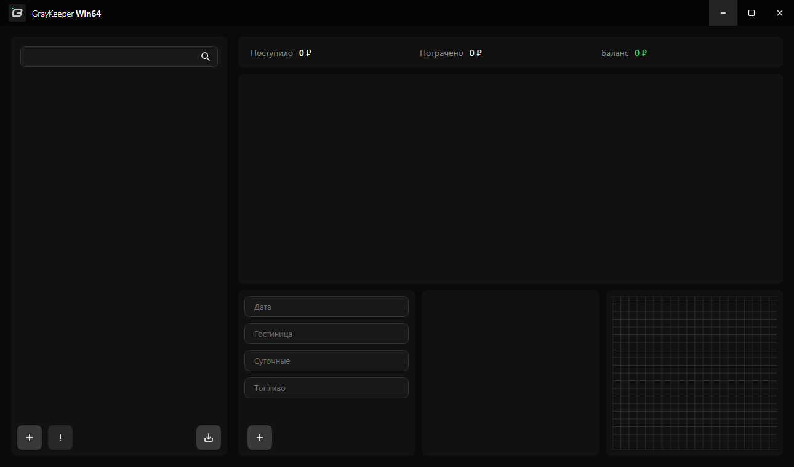

 

Системные требования

Для работы приложения необходима операционная система Windows 10 или 11 (64-bit).  
Благодаря оптимизации вычислений, программа имеет крайне низкие системные требования.

| Компонент | Минимальные требования | Рекомендуемые требования |
| :--- | :--- | :--- |
| **ОС** | Windows 10 (64-bit) | Windows 10, 11 (64-bit) |
| **Процессор** | 2-ядерный, от 1.6 ГГц (Intel Core i3, AMD Ryzen 3) | 4-ядерный, от 2.5 ГГц (Intel Core i5, AMD Ryzen 5) |
| **Память (RAM)** | 4 ГБ | 4 ГБ или более |
| **Видеокарта** | Встроенная (с поддержкой DirectX 9) | Встроенная (с поддержкой DirectX 12) |
| **Диск** | ~250 МБ | 500 МБ |

> ⚠️ **Важно:** Для запуска приложения, на вашем компьютере должен быть установлен [.NET Desktop Runtime 8.0](https://builds.dotnet.microsoft.com/dotnet/Runtime/8.0.30/dotnet-runtime-8.0.30-win-x64.exe)
